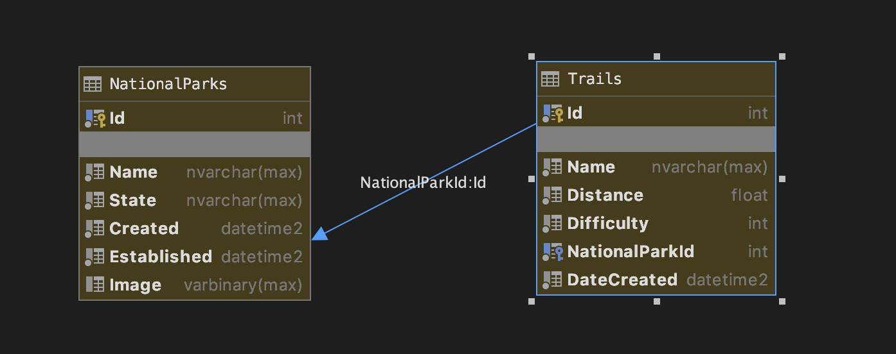
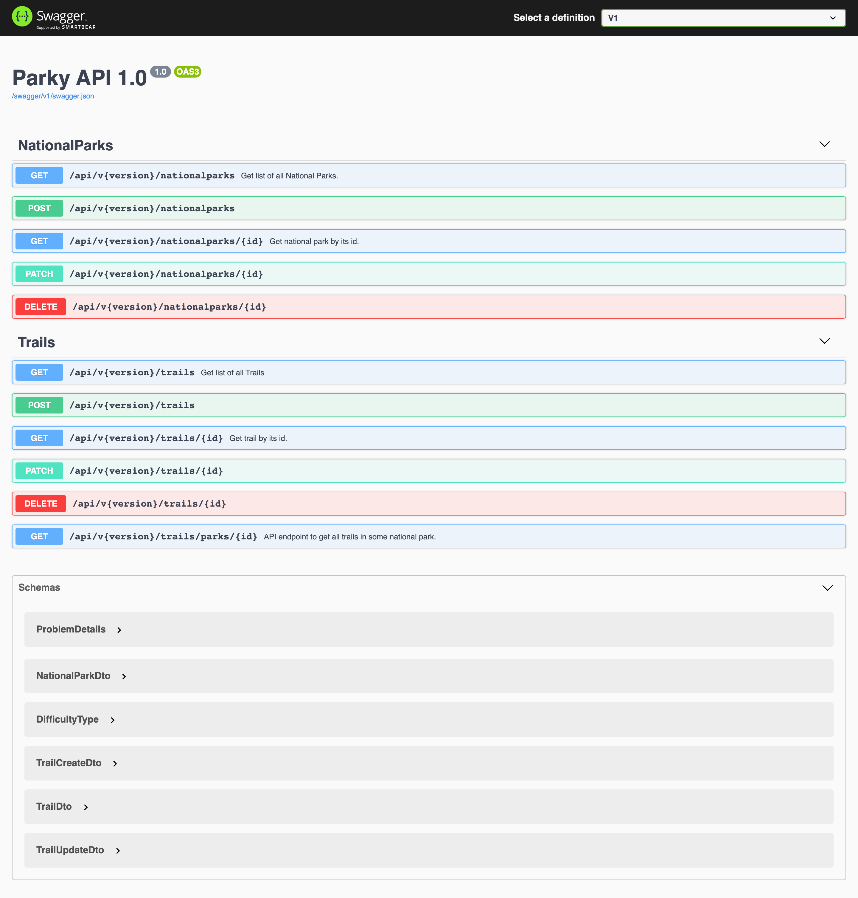
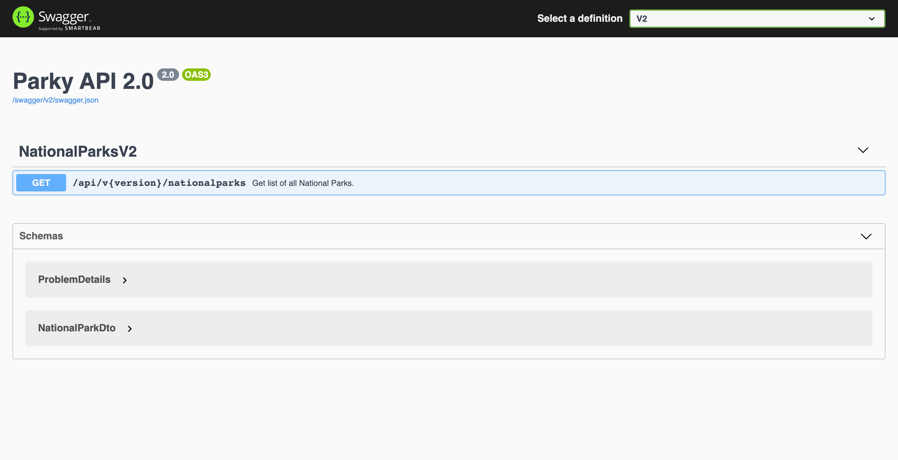

# API for National Parks (Parky)
[](https://www.repostatus.org/#active)
## Technology stack : 
1. ASP.NET Core WebAPI
2. Entity Framework Core
3. Microsoft SQL Server
4. Automapper: https://automapper.org/
5. Swagger.AspNetCore Nouget package : https://swagger.io/
6. Repo status : https://www.repostatus.org/
7. `Toastr.js` : https://github.com/CodeSeven/toastr
8. Sweet alert 2 : <https://sweetalert2.github.io/>
9. Datatables : https://datatables.net/
10. Bootstrap 3
## Description:

* Code-first approach used
* Repository pattern used
* DTO pattern used
* `appsettings.json` file is excluded from project since it contains connection string for the SQL Server with password.
* Versioning used.
* Authorization with JWT tokens added.
* Some parts are simply commented so in future I can find and reuse them.
* ASP.NET Core MVC project `ParkyWeb` is used for API consumption.
* MVC part for users added.

## MVC part :
* Currently it supports all API methods for National Parks and Trails. 
* Parks and Trails are displayed in the table using `datatables`.
* Parks and Trails can be added, deleted, updated. There are corresponding buttons for those actions.
* After each action `toastr` alert is shown.
* Before `DELETE` action `sweeralert2` asks you to confirm the deletion of an object.
* When image is uploaded to the form it triggers `js` code updating picture on the page. 
**Workflow** : 
```f#
data is displayed -> update/create button is clicked -> Upsert view defines whether this is update or create (by cheking id) -> form is displayed -> after action user returned to the updated database list.
```
```f#
data is displayed -> delete button is clicked -> User is asked to confirm -> if successfull - table updates using AJAX.
```
All `NON-GET` (`PATCH`,`POST`,`DELETE`) requests to the API are sent using `Javascript`, as it is more convenient than using `HTTPClient` in the View. Also, it simplifies data processing in `js` afterwards. 
<br/>
Moreover, Cookies were added + for editing / deleting parks and trails user should be authorized.
<br/>

<br/>
Similar workflow is correspondent for Trails. <br/>
## API part : 
This project contains small API for information about national parks in the US.
Currently it has endpoints for `CRUD` operations on National Parks and Trails. <br/>
 <br/>
* `Automapper` is used to convert DTO objects to the Models and vice versa.
* In migrations a simple database seeding is performed.
* For documentation `Swagger` was used (with XML commenting).
* For authentication and authorization JWT tokens were used with `Role` claims. 
* Also, there was added functionality for registering and authenticating users using `POST` requests. Passwords are stored in non-encrypted from in the database for the simplicity. 
Those are OpenAPI specs for versioning (version 2 was added for simple demonstration): <br/>
**Version 1:** <br/>
 <br/>
**Version 2:** <br/>
 <br/>
