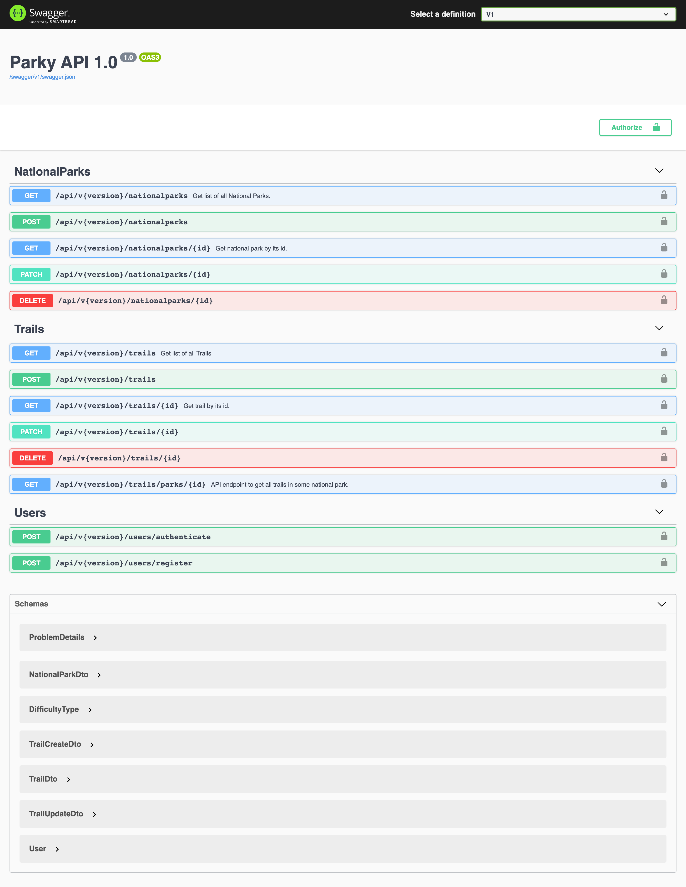

# API for National Parks (Parky)

## Technology stack : 
1. ASP.NET Core WebAPI
2. Entity Framework Core
3. Microsoft SQL Server
4. Automapper: https://automapper.org/
5. Swagger.AspNetCore Nouget package : https://swagger.io/
6. Repo status : https://www.repostatus.org/
## Description:

* Code-first approach used
* Repository pattern used
* DTO pattern used
* `appsettings.json` file is excluded from project since it contains connection string for the SQL Server with password.
* Versioning used.
* Some parts are simply commented so in future I can find them.
 
* Authentication will be added.
* There will be second project added for the consumption of previously developed API.

This project contains small API for information about national parks in the US.
Currently it has endpoints for `CRUD` operations on National Parks and Trails.  
  
`Automapper` is used to convert DTO
objects to the Models and vice versa.  
In migrations a simple database seeding is performed.  
For documentation `Swagger` was used (with XML commenting). 
Those are OpenAPI specs for versioning (version 2 was added for simple demonstration):  
**Version 1:** 
 
**Version 2:** 
  
